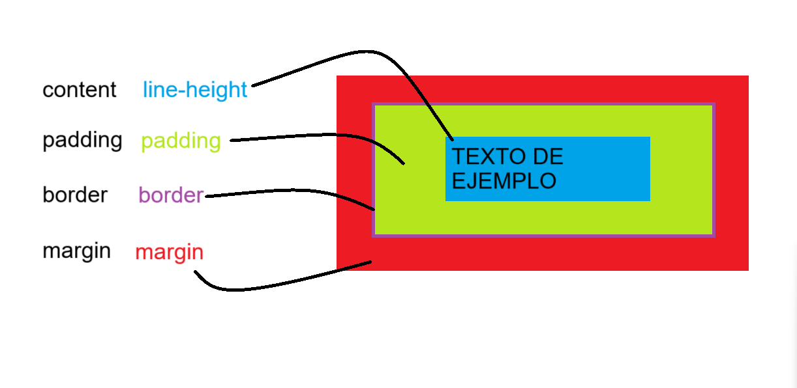

### **Box Model en CSS**

El **Box Model** es el modelo conceptual que utiliza CSS para definir cómo los elementos ocupan espacio en una página web. Este modelo incluye los siguientes componentes, desde el interior hacia el exterior:

---

## **1. Content (Contenido)**

El contenido es la parte central de la caja, donde se coloca el texto, imágenes u otros elementos.  
- **Propiedad relevante:** `line-height`  
  - Ajusta el **espaciado vertical** entre las líneas del texto.
  - También influye en la altura del contenido interno.

```css
.caja {
  line-height: 1.5; /* Espaciado entre líneas */
}
```

---

## **2. Padding (Relleno interno)**

El **padding** es el espacio entre el contenido y el borde de la caja.  
- Se utiliza para dar **espaciado interno**, asegurando que el contenido no toque los bordes.  
- Puede definirse con valores individuales o combinados:
  - **Un valor:** `padding: 10px;` (para todos los lados).
  - **Dos valores:** `padding: 10px 20px;` (arriba/abajo, derecha/izquierda).
  - **Tres valores:** `padding: 10px 15px 20px;` (arriba, derecha/izquierda, abajo).
  - **Cuatro valores:** `padding: 10px 15px 20px 5px;` (arriba, derecha, abajo, izquierda).

```css
.caja {
  padding: 10px 15px 20px 5px; /* Espaciado en orden: arriba, derecha, abajo, izquierda */
}
```

---

## **3. Border (Borde)**

El **borde** es el contorno de la caja.  
- Puede tener diferentes estilos (`solid`, `dotted`, `dashed`, etc.), ancho y color.

```css
.caja {
  border: 2px solid black; /* Borde negro sólido de 2px */
}
```

---

## **4. Margin (Margen)**

El **margen** es el espacio entre el borde de una caja y otros elementos circundantes.  
- Se utiliza para dar **espaciado externo** entre elementos.  
- Sigue el mismo orden de configuración que el padding.

```css
.caja {
  margin: 20px 10px; /* Espaciado arriba/abajo: 20px, derecha/izquierda: 10px */
}
```

---

## **Relación entre los Componentes**

La imagen ilustra cómo cada parte del modelo interactúa entre sí:

1. **Content (Contenido):** La parte más interna.
2. **Padding:** Rodea el contenido, separándolo del borde.
3. **Border:** Envuelve el padding y contenido.
4. **Margin:** Rodea el borde, separando la caja de otros elementos.

---

## **Ejemplo Grafico**


- La imagen muestra las distintas partes del **Box Model** en un elemento HTML:
  1. **Content:** Representa el contenido central de la caja (texto o imágenes).
  2. **Padding:** Separa el contenido del borde.
  3. **Border:** El contorno visible que envuelve el padding.
  4. **Margin:** El espacio exterior que separa el elemento de otros.


---

### 🌐 Navegación

- <-- Anterior : [Bordes](Border's.md)  
- --> Siguiente : [Box y Text Shadow](Box%20y%20Text%20Shadow.md)

