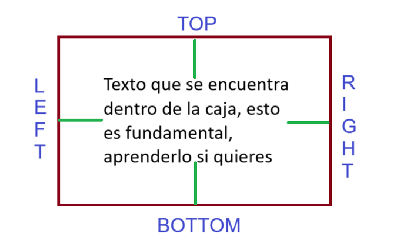
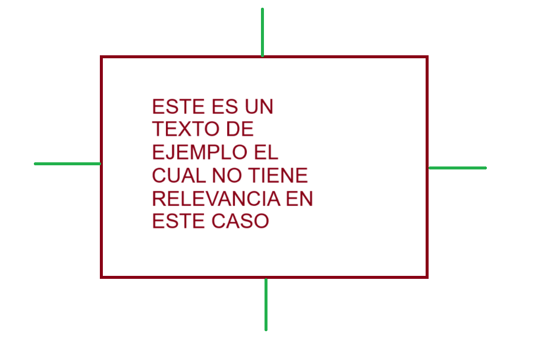

# **Propiedades de las Cajas en CSS**

En CSS, las cajas representan la estructura y diseño de los elementos HTML. Estas cajas tienen propiedades que definen su tamaño, apariencia y espaciado.

---

## **1. Tamaño de las Cajas**

El tamaño de una caja está determinado por las propiedades `width` y `height`.

```css
.caja {
  width: 200px; /* Ancho */
  height: 100px; /* Alto */
}
```

---

## **2. Color de Fondo**

Define el color o imagen que llena el fondo de la caja.

### **Color de Fondo (`background-color`):**

```css
.caja {
  background-color: lightblue; /* Fondo azul claro */
}
```

### **Imagen de Fondo (`background-image`):**

```css
.caja {
  background-image: url('imagen.jpg'); /* Imagen como fondo */
  background-size: cover; /* Ajusta la imagen al tamaño de la caja */
}
```

---

## **3. Espaciado Interno (`padding`)**

El `padding` es el espacio interno entre el contenido de la caja y sus bordes. Esto asegura que el contenido dentro de la caja no esté pegado al borde.

### **Maneras de Definir el Padding:**

1. **Definición Simple:**

```css
.caja {
  padding: 10px; /* Aplica 10px de espaciado en los cuatro lados (top, right, bottom, left). */
}
```

2. **Definición por Dos Valores:**

```css
.caja {
  padding: 10px 20px; /* 
  - 10px: Aplica al top y bottom.
  - 20px: Aplica al right y left.
  */
}
```

3. **Definición por Tres Valores:**

```css
.caja {
  padding: 10px 20px 15px; /* 
  - 10px: Aplica al top.
  - 20px: Aplica al right y left.
  - 15px: Aplica al bottom.
  */
}
```

4. **Definición Completa:**

```css
.caja {
  padding: 10px 20px 15px 5px; /* 
  - 10px: Aplica al top.
  - 20px: Aplica al right.
  - 15px: Aplica al bottom.
  - 5px: Aplica al left.
  */
}
```

### **Definición Independiente:**

Puedes definir el padding para cada lado de forma independiente:

```css
.caja {
  padding-top: 10px;    /* Espaciado superior */
  padding-right: 20px;  /* Espaciado derecho */
  padding-bottom: 15px; /* Espaciado inferior */
  padding-left: 5px;    /* Espaciado izquierdo */
}
```

### Representación Visual del Padding:


---

## **4. Espaciado Externo (`margin`)**

El `margin` es el espacio externo entre la caja y otros elementos cercanos. Esto asegura que la caja no esté pegada a otros elementos.

### **Maneras de Definir el Margin:**

1. **Definición Simple:**

```css
.caja {
  margin: 10px; /* Aplica 10px de espaciado en los cuatro lados (top, right, bottom, left). */
}
```

2. **Definición por Dos Valores:**

```css
.caja {
  margin: 10px 20px; /* 
  - 10px: Aplica al top y bottom.
  - 20px: Aplica al right y left.
  */
}
```

3. **Definición por Tres Valores:**

```css
.caja {
  margin: 10px 20px 15px; /* 
  - 10px: Aplica al top.
  - 20px: Aplica al right y left.
  - 15px: Aplica al bottom.
  */
}
```

4. **Definición Completa:**

```css
.caja {
  margin: 10px 20px 15px 5px; /* 
  - 10px: Aplica al top.
  - 20px: Aplica al right.
  - 15px: Aplica al bottom.
  - 5px: Aplica al left.
  */
}
```

### **Definición Independiente:**

Puedes definir el margin para cada lado de forma independiente:

```css
.caja {
  margin-top: 10px;    /* Espaciado superior */
  margin-right: 20px;  /* Espaciado derecho */
  margin-bottom: 15px; /* Espaciado inferior */
  margin-left: 5px;    /* Espaciado izquierdo */
}
```

### Representación Visual del Margin:


---

## **Ejemplo Completo**

```html
<!DOCTYPE html>
<html lang="es">
<head>
  <meta charset="UTF-8">
  <meta name="viewport" content="width=device-width, initial-scale=1.0">
  <title>Propiedades de las Cajas</title>
  <style>
    .caja {
      width: 300px;
      height: 150px;
      background-color: lightblue;
      padding: 10px 20px 15px 5px;
      margin: 15px 25px 20px 10px;
      font-size: 16px;
      font-family: Arial, sans-serif;
      color: black;
    }
  </style>
</head>
<body>
  <div class="caja">Caja con propiedades de padding y margin aplicadas.</div>
</body>
</html>
```

---

## **Tabla de Propiedades de Espaciado**

| **Propiedad**       | **Descripción**                                                                                  |
|---------------------|--------------------------------------------------------------------------------------------------|
| `padding`           | Define el espaciado interno entre el contenido de la caja y sus bordes.                         |
| `margin`            | Define el espaciado externo entre la caja y otros elementos.                                    |
| `padding-top`       | Espaciado interno en la parte superior.                                                         |
| `padding-right`     | Espaciado interno en el lado derecho.                                                           |
| `padding-bottom`    | Espaciado interno en la parte inferior.                                                         |
| `padding-left`      | Espaciado interno en el lado izquierdo.                                                         |
| `margin-top`        | Espaciado externo en la parte superior.                                                         |
| `margin-right`      | Espaciado externo en el lado derecho.                                                           |
| `margin-bottom`     | Espaciado externo en la parte inferior.                                                         |
| `margin-left`       | Espaciado externo en el lado izquierdo.                                                         |

---

### 🌐 Navegación

- <-- Anterior : [Teoría de Cajas](Teoría%20de%20Cajas.md)
- --> Siguiente : [Border's](Border's.md)
