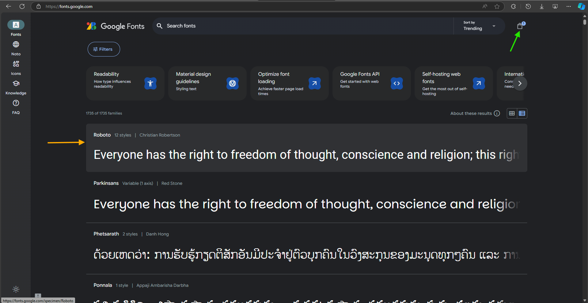
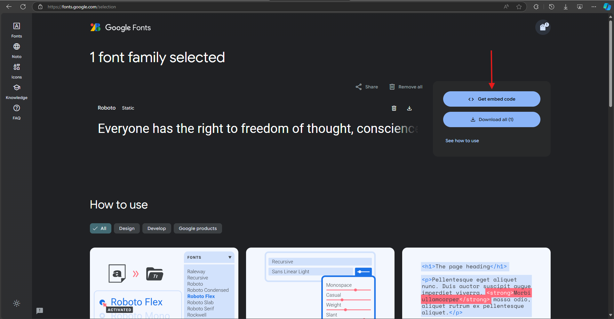
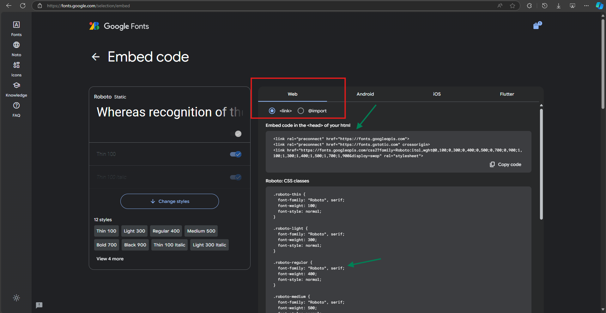
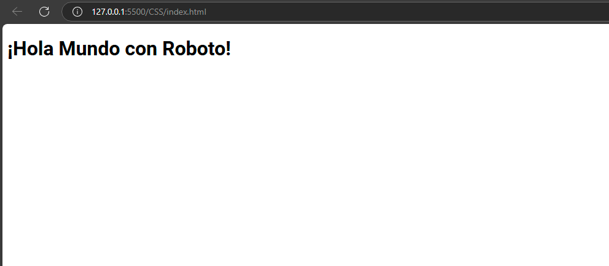

# Propiedades del Texto en CSS

Las propiedades del texto en CSS son fundamentales para controlar cómo se ve el texto en una página web. Estas propiedades permiten ajustar aspectos como tamaño, tipo de fuente, interlineado, variantes y ancho.

---

## **Propiedades del Texto**

### **1. `font-size`**
Define el tamaño de la fuente. Se puede expresar en unidades relativas (`em`, `%`) o absolutas (`px`, `pt`).

```css
p {
  font-size: 16px;
}
```

### **2. `font-family`**
Especifica la fuente o familia de fuentes para el texto. Es común usar una lista de fuentes como respaldo.

```css
body {
  font-family: "Arial", sans-serif;
}
```

### **3. `line-height`**
Controla el espacio vertical entre las líneas de texto. Se recomienda usar valores relativos para diseño responsivo.

```css
p {
  line-height: 1.5;
}
```

### **4. `font-variant`**
Define variantes de texto, como texto en pequeñas mayúsculas (`small-caps`).

```css
p {
  font-variant: small-caps;
}
```

### **5. `font-weight`**
Controla el grosor del texto. Los valores comunes son:
- `normal`: Grosor estándar.
- `bold`: Texto en negrita.
- Valores numéricos: De `100` (más delgado) a `900` (más grueso).

```css
h1 {
  font-weight: 700;
}
```

### **6. `font-height`**
Controla la altura total de la línea. No es una propiedad estándar, pero se puede simular combinando `line-height` y `font-size`.

```css
p {
  font-size: 16px;
  line-height: 24px;
}
```

---

## **Agregar Fuentes Externas con Google Fonts**

### **Paso a Paso para Agregar Google Fonts**

1. **Accede a Google Fonts**
   Visita [Google Fonts](https://fonts.google.com) y selecciona la fuente que deseas usar (por ejemplo, "Roboto").
   
   

2. **Selecciona la Familia de Fuentes y Obten la Fuente**
   Haz clic en la fuente deseada y selecciona los estilos que necesites (por ejemplo, "Thin 100", "Bold 700"), posteriormente haz click en **Get Font**.
   
   

3. **Obtén el Código de Inserción**
   Copia el enlace generado en el apartado "Embed code" para integrarlo en el archivo HTML.
   
   

4. **Integra la Fuente en tu HTML**
   Añade el enlace en la sección `<head>` de tu documento.

```html
<!DOCTYPE html>
<html lang="es">
<head>
  <meta charset="UTF-8">
  <meta name="viewport" content="width=device-width, initial-scale=1.0">
  <title>Fuente Externa</title>
  <link rel="preconnect" href="https://fonts.googleapis.com">
  <link href="https://fonts.googleapis.com/css2?family=Roboto:wght@100;300;400;700&display=swap" rel="stylesheet">
</head>
<body>
  <h1 style="font-family: 'Roboto', sans-serif;">¡Hola Mundo con Roboto!</h1>
</body>
</html>
```

5. **Aplica la Fuente en CSS**
   Puedes usar `font-family` en el archivo CSS para aplicar la fuente seleccionada.

```css
body {
  font-family: "Roboto", sans-serif;
}
```

   

---

## **Beneficios de Usar Fuentes Externas**
- Personalización avanzada del diseño.
- Mayor variedad de estilos tipográficos.
- Diseño más atractivo y profesional.

---

### 🌐 Navegación

- <-- Anterior : [Unidades](Unidades.md)
- --> Siguiente : [Teoría de Cajas](Teoría%20de%20Cajas.md)
