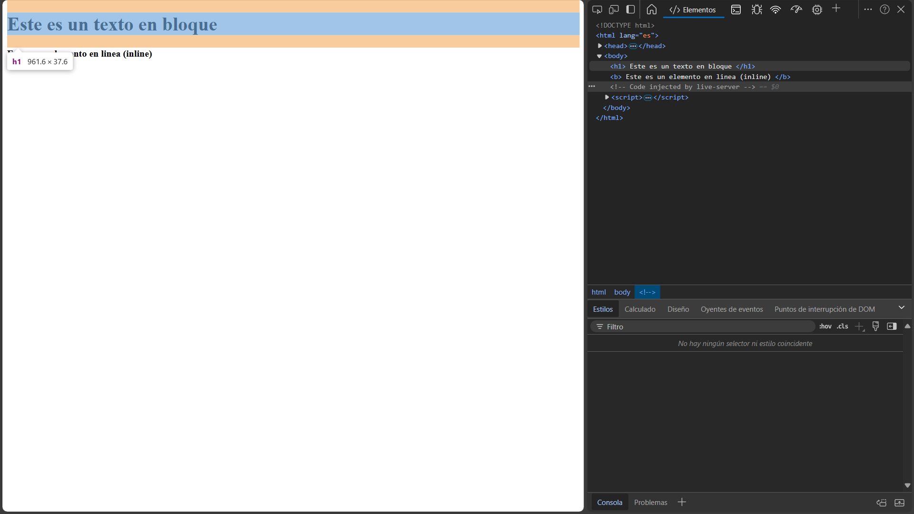
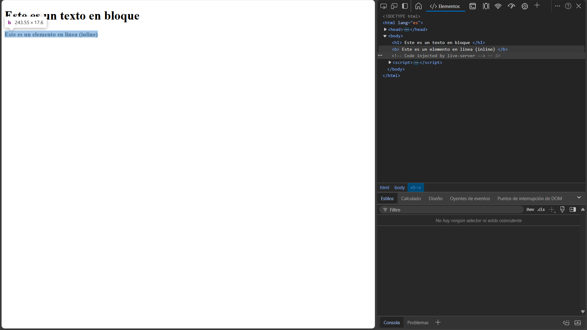

# **Teoría de Cajas Naturales en CSS**

La **teoría de cajas naturales** es un concepto clave en CSS. Define cómo los elementos HTML se comportan y se organizan en una página web. Cada elemento HTML se representa como una caja rectangular, cuyo tamaño y propiedades pueden ajustarse con CSS.

---

## **Tipos de Elementos: En Bloque y En Línea**

### **1. Elementos en Bloque**

- Los elementos en bloque ocupan todo el ancho disponible de su contenedor y empiezan en una nueva línea.
- Siempre "rompen" el flujo del contenido, es decir, el siguiente elemento aparece debajo.
- Estos elementos suelen ser usados para organizar el contenido de manera estructurada.

#### **Ejemplos de Elementos en Bloque:**
- `<div>`: Contenedor genérico.
- `<h1>`, `<h2>`, `<h3>` (encabezados).
- `<p>`: Párrafos.
- `<section>`, `<article>`, `<footer>`.

#### **Así se ve un elemento en bloque:**


---

### **2. Elementos en Línea**

- Los elementos en línea solo ocupan el espacio necesario para su contenido.
- No "rompen" el flujo del contenido, es decir, pueden colocarse uno al lado del otro en la misma línea.
- Son ideales para aplicar estilos a palabras o fragmentos de texto específicos.

#### **Ejemplos de Elementos en Línea:**
- `<b>`: Texto en negrita.
- `<i>`: Texto en cursiva.
- `<span>`: Contenedor genérico para texto en línea.
- `<a>`: Enlaces.
- `<small>`: Texto con tamaño reducido.

#### **Así se ve un elemento en línea:**


---

## **Diferencia Visual entre Bloque e Inline**

### Ejemplo con Elementos en Bloque:

```html
<h1>Este es un encabezado</h1>
<p>Este es un párrafo en bloque.</p>
```

### Ejemplo con Elementos en Línea:

```html
<p>
  Este es un texto con <b>negritas</b>, <i>cursivas</i>, y un <a href="#">enlace</a>.
</p>
```

---

### Comparación:

| **Propiedad**             | **En Bloque**                                 | **En Línea**                               |
|---------------------------|-----------------------------------------------|-------------------------------------------|
| **Ocupación del Espacio** | Todo el ancho disponible                     | Solo el espacio necesario para el contenido |
| **Rompe línea**           | Sí                                           | No                                        |
| **Usos comunes**          | Estructurar contenido                        | Dar formato a texto específico            |

---

### 🌐 Navegación

- <-- Anterior : [Propiedades del Texto](Propiedades%20del%20Texto.md)
- --> Siguiente : [Propiedades de las cajas](Propiedades%20de%20las%20cajas.md)


